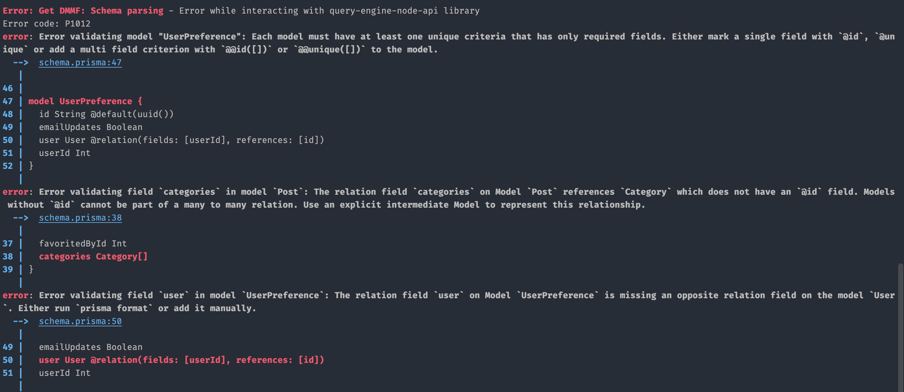

# Prisma with Nextjs

## Nextjs
Nextjs는 SSR을 지원하는 리액트 프레임워크로, 프레임워크를 위한 프레임워크 라고 소개하고 있습니다.

리액트는 CSR(client side rendering)만을 지원하는 반면 Nextjs는 SSR(server side rendering)을 지원하므로 js 번들을 받기 전 html 렌더링이 가능합니다.
이를 통해 더 빠른 페인팅과 리플로우로 응답속도를 향상시킬 수 있고, 더 나은 사용자경험을 줄 수 있습니다.

또한 정적인 페이지가 존재하므로 SEO 에도 유리한 면이 있습니다.

주목해야할 점은 Nextjs 에서는 두개의 서버가 돌아가고 있다는 점입니다. 

클라이언트 사이드와 서버 사이드에 각각 서버가 있습니다. 클라이언트 사이드는 우리가 알고 있는 기존의 리액트 역할을 합니다.
핵심은 서버사이드 인데, 서버사이드에서 특정 리소스에 대한 응답이 올때까지 클라이언트의 응답을 미루거나 
작성된 컴포넌트를 컴파일 하여 정적인 html 페이지를 만들어서 전달하는 역할 등 우리가 알고 있는 BE 서버와 같은 역할을 합니다.

Nextjs 에서의 라우팅은 pages 폴더로 결정됩니다. 다시 말해 pages 안에 있는 폴더들은 자동으로 해당 페이지의 경로가 됨을 의미합니다.
이 가운데 api 폴더는 특별한 역할을 하는데, Nextjs 는 http://localhost:3000/api/ 로 오는 모든 요청을 Nextjs 서버로의 요청으로 받아들이고 처리합니다.

`curl http://localhost:3000/api/hello`

그래서 별도의 백엔드 서버를 띄우지 않고, Nextjs 의 /pages/api 폴더 안에서 api에 대한 응답을 작성하는 것이 가능합니다!

진정으로 서버로 동작하기 위해서는 데이터베이스에 접근할 수 있어야 합니다. 이 역할을 도와주는 Prisma 에 대해 같이 알아보겠습니다.

## Prisma
Prisma 는 Node.js 와 타입스크립트 를 위한 도구 입니다. 데이터베이스와 타입스크립트 의 사이에 다리를 놓아 주는 역할을 합니다.
다시 말해 SQL 또는 데이터베이스의 언어를 몰라도 사용가능하게 해주는데 이를 ORM(Object Relational Mapping)이라고 합니다.

Prisma 는 타입스크립트 기반이므로 반드시 타입스크립트를 설치해야 합니다.

```shell
npm i -D prisma typescript
```

설치했다면 이제 `npx prisma` 로 시작하는 명령어로 Prisma 를 조작할 수 있습니다.

Prisma 를 알기 위해서는 두가지를 알아야 합니다. 바로 스키마(Schema)와 클라이언트(PrismaClient) 입니다.

### Schema

데이터베이스를 사용하려면 먼저 데이터베이스가 어떻게 생겼는지 알아야 합니다. 

Prisma 에게 데이터베이스에 대해 알려주기 위한 파일이 바로 schema.prisma 파일입니다.
schema.prisma 에 코드를 작성해서 데이터베이스가 어떻게 생겼는지 설명을 해주어야 합니다.

Prisma 가 schema 파일을 봐야 하는 이유는 크게 두가지 입니다.
1. 모델들을 데이터베이스에 푸시하고 SQL 마이그레이션을 자동으로 처리하기 위해서
2. 데이터베이스와 상호작용하기 위해 client 를 생성하고, client 가 자동완성으로 타입들을 추가하기 위해

먼저 보면 generator 가 보이는데, client 와 db 가 있습니다. 여기서는 Prisma client 를 위해 스키마를 만드므로 `prisma-client-js` 라고 적어줍니다.

db 에는 사용할 데이터베이스를 적어줍니다. 다양한 데이터베이스를 사용할 수 있으며 GraphQL 도 플러그인 형태로 연결해서 사용할 수 있습니다.
주의할 점은 Prisma 는 딱 한개의 데이터베이스만 가질 수 있다는 점입니다. 

데이터베이스 url 을 환경변수로 숨기는 점도 눈여겨 볼 필요가 있습니다. 
기본적으로 데이터베이스 주소에 비밀번호와 개인정보가 들어가기 떄문에 `.env` 파일에 은닉하는 것이 필요합니다.
또한 `.env` 파일을 사용하므로 개발환경마다 다른 데이터베이스에 연결하는 것 또한 가능합니다.

그리고 모델을 작성해줍니다. 모델의 경우 이름과 타입을 가지고 다양한 옵션을 가집니다.
코드를 보면서 설명합니다. User 모델을 기반으로 1-1, 1-N, M-N 관계를 같이 볼 수 있습니다.

이렇게 다 만들면 `npx prisma generate` 명령어를 통해 client 를 생성할 수 있습니다.

나중에 client 의 동작도 전부 짜고 나면 `npx prisma db push` 명령어를 통해 해당 모델을 데이터베이스에 밀어 넣을 수 있습니다.

### Prisma Client
모델의 정합성이 맞으면 prisma 는 데이터베이스를 이해하고 이를 바탕으로 client 를 생성합니다.
여기서 만약 에러가 있다면 친절하게 설명도 해 줍니다.


client 가 완성되고 나면 이제 PrismaClient 를 생성해서 사용할 수 있습니다.
Prisma 는 이제 데이터베이스에 관한 모든 것을 알고 있기 때문에 모든 명령어에서의 자동완성을 해줍니다.

이제 PrismaClient 를 생성하고 Nextjs 의 서버사이드에서 데이터베이스와의 연결을 위해 사용할 수 있습니다.

사용의 편의성을 위해 PrismaClient를 싱글턴으로 생성하여 사용합니다.
